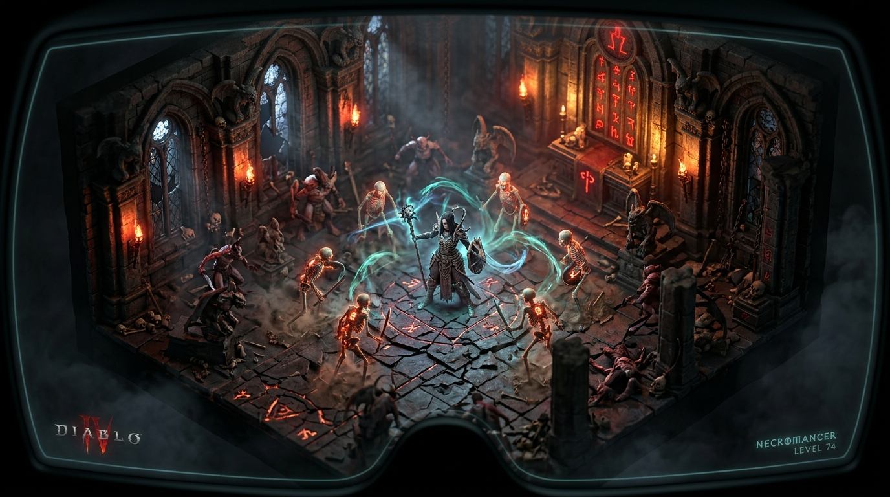

# ⚔️ Diablo IV VR — Édition Française v1.0.0

  
  
  
  

  

---

## 🩸 Présentation

**Diablo IV VR** transforme le Sanctuaire en une immense **maquette vivante stéréoscopique 3D** (*Effet Diorama Tilt-Shift*). Observez vos légions de squelettes et vos sorts déchaînés avec un relief et une profondeur de champ volumétrique saisissante, directement dans votre casque VR sous OpenXR !

### 🌟 Points Forts
- **Vue Diorama 3D Stéréoscopique** : Immersion en relief avec séparation oculaire naturelle et vue plongeante.
- **Support DLSS 3.7+ & Frame Generation** : Fluidité maximale à 120 FPS et anti-aliasing sans aucun scintillement.
- **Thème Graphique Sanctuaire** : Interface WPF aux couleurs du sang de Lilith et de l'or runique.
- **Restauration Vanilla 100% Réversible**.

---

  <b>Conçu et signé par LordMadTrix.</b>

---

## 🥽 Guide Casque VR : Que faire une fois dans le casque ?

### 1. Connexion initiale du casque au PC
1. **Allumez votre Meta Quest 3**.
2. Connectez votre casque via **ALVR**, **Virtual Desktop** ou **Quest Link**.
3. Confirmez l'accès à **SteamVR**.

### 2. Lancement du jeu
- Sur le PC, cliquez sur **🚀 LANCER EN VR** dans `Diablo4VR-Setup.exe`.

### 3. Expérience Diorama 3D dans le casque
- **Effet Maquette Vivante** : Sanctuaire flotte devant vous avec un relief 3D volumétrique saisissant.
- **Contrôles** : Jouez confortablement assis avec votre manette Xbox / PlayStation habituelle ou votre clavier/souris.
- **Recentrer la vue** : Maintenez le bouton **Meta** (manette droite) pendant 2 secondes pour caler le donjon exactement à votre hauteur de regard.
- **Fluidité 120 FPS** : Le DLSS 3.7+ et la Frame Generation maintiennent une clarté absolue sans fatigue oculaire.
